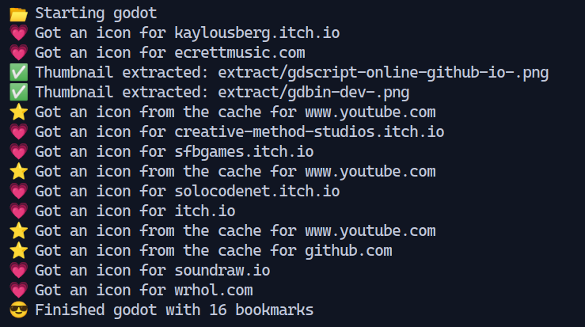
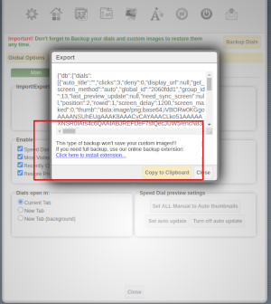
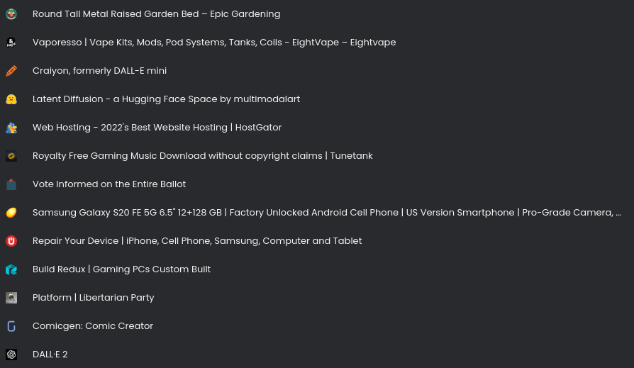

# Convert FVD Speed Dial exports to a generic bookmarks file

## Installing the script
1. Make sure you have Node installed
2. Extract / Clone the repository to any directory you like
3. Open a dos window and change to that directory
4. Run: **npm i**

This will install a module that the script requires

## How to use
1. Go to FVD Speed Dial->Options->Export (It will give you a long JSON string, copy it to the clipboard)
2. Create a file, paste the data you just copied and save the file
3. Run this script, node index.js -i [source file] -o [output file]

**Example:**
node index.js -i myFvdBookmarks.json -o import.html -f

## Getting a favicon
You can grab the favicon from the site and add it to
the data that will be imported via the html import file.

This option will make the script take longer to run.  The script will connect to every host and download the favicon

Command line option: -f

**Example:**
node index.js -i myFvdBookmarks.json -o import.html -f

## Extracting the thumbnails
You can extract thumbnail images from your FDV bookmarks file.
Please note, it the image was captured automatically by the FDV
plug in, then it does not exist in the exported data.

The only thumbnails you will be able to extract are the ones you
set manually.

Command line option: -x [output directory]

**Example:**
node index.js -i myFvdBookmarks.json -o import.html -f -x ./images/

## After you import the html with the -f option

