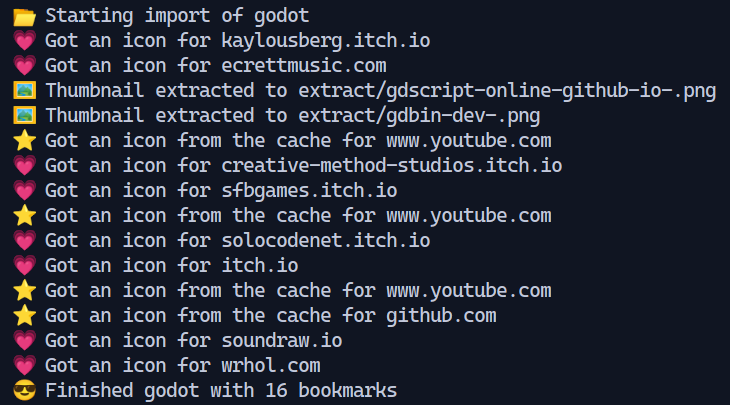

# FVD Speed Dial Export Converter



## Description

This script allows you to convert FVD Speed Dial exports to a generic bookmarks file format. It provides additional functionalities such as extracting favicons and thumbnails associated with the bookmarks.

## Installation

To install and use the script, please follow these steps:

1. Ensure that Node.js is installed on your system.
2. Extract or clone the repository to a preferred directory.
3. Open a command prompt or terminal window and navigate to the repository directory.
4. Run the following command to install the required module:

```
npm install
```
 
## Usage
Follow the steps below to convert your FVD Speed Dial exports:

1. In FVD Speed Dial, navigate to Options -> Export. This will provide you with a long JSON string representing your bookmarks. Copy this string to the clipboard.
2. Create a new file and paste the copied JSON data into it. Save the file.
3. Run the conversion script using the following command:

```
node index.js -i [source file] -o [output file]
```

Replace `[source file]` with the path to the file containing the JSON data and `[output file]` with the desired name for the converted bookmarks file.

```
node index.js -i myFvdBookmarks.json -o import.html
```

## Favicons

You have the option to include favicons in the imported bookmarks via the HTML import file. Please note that enabling this feature will increase the script's execution time as it connects to each host and downloads the respective favicons.

To include favicons, use the `-f` command line option:

```
node index.js -i myFvdBookmarks.json -o import.html -f
```

## Thumbnails

If you manually set thumbnails for your FVD bookmarks, you can extract and include them in the converted bookmarks file. Please be aware that only manually set thumbnails are available for extraction; automatically captured thumbnails by the FVD plugin are not included in the exported data.

To extract thumbnails, use the following command line option: 
`-x [output directory]`

Replace `[output directory]` with the desired directory path where you want the thumbnail images to be saved.

```
node index.js -i myFvdBookmarks.json -o import.html -f -x ./images/
```


## After Importing the Bookmarks

Once you import the generic bookmarks file into a browser (generated with the `-f` option), you can expect the imported bookmarks to appear as shown below:


